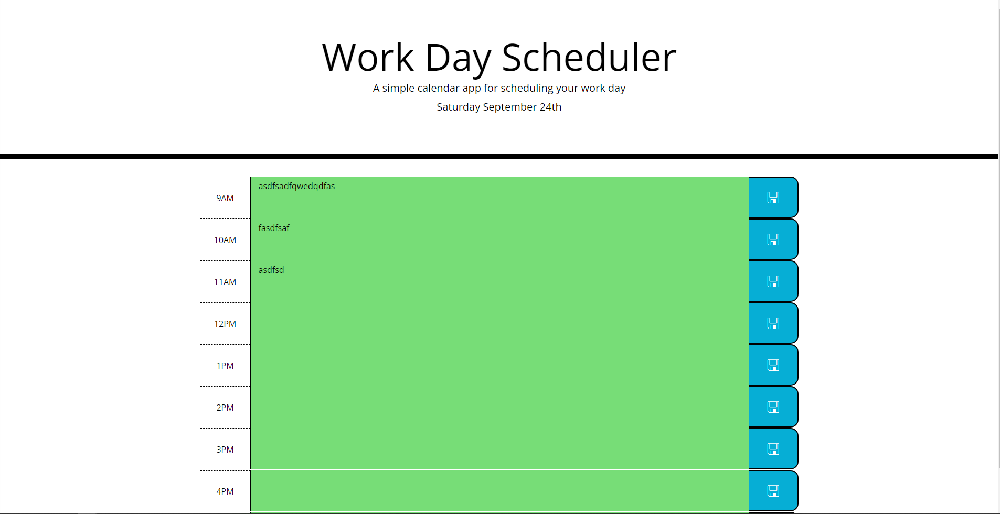

# Khievs-Work-Day-Scheduler

This is a website that is a day planner.

## Description

Khiev's Work Day Scheduler: [Link](https://chrissnakhiev.github.io/Khievs-Work-Day-Scheduler/)

Khievs-Work-Day-Scheduler github: [Link](https://github.com/ChrissnaKhiev/Khievs-Work-Day-Scheduler)

This is a day planner for the work day of 9 to 5. You can add todos into the planner and save it so it will remain there even if you leave the page. This remains because of the local storage. As the hours change during the day, the planner will auto organize the agenda via colors depending on past, present, and future.

## Installation

N/A

## Usage

User will be able to log a todo list in each hour and it will persist in the local storage. This will help maintain a schedule and productivity.

## Credits

N/A

## License

Please refer to the LICENSE in the repo.